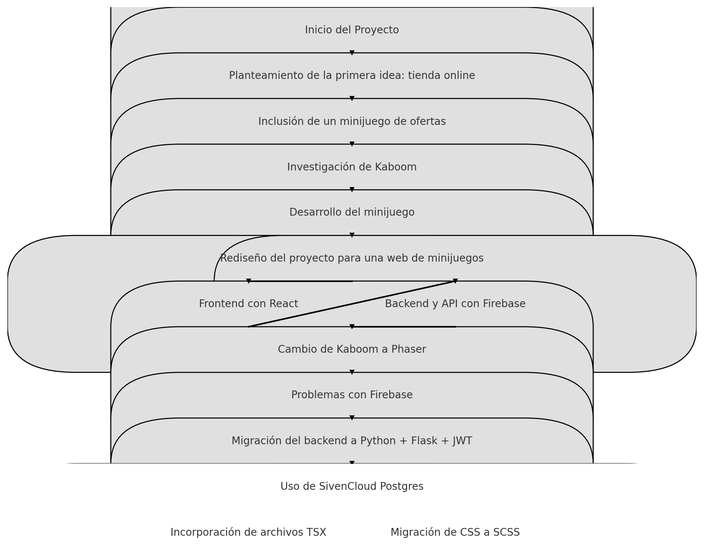

# ABOUT THIS PROJECT:
### url: https://gama-v8p0.onrender.com
### *DEVS:*

* Gerard de Tena
* Adrián Araque
* Mauro SantAngelo
* Alejandro De Vitta

-----------------------------------------------------------------------------------------

## Technologies:
	
| Frontend | Backend |
|----------|---------|
| React    | Python  |
| Phaser3  | Flask   |
| SCSS     | Aiven   |

## Flow-Diagram of all project phases:




1. ### Project Start

* Initial idea: Online store
* Inclusion of a discount minigame
* Research and Development

2. ### Research on Kaboom:

* Development of the minigame
* Change of Focus

3. ### Redesign of the project to a minigames website

* Frontend with React
* Backend and API with Firebase

4. ### Technology Migration

* Change from Kaboom to Phaser
* Issues with Firebase
* Migration of backend to Python + Flask + JWT
* Use of MySQL on Local
* Migrate to AivenCloud PostgreSQL

5. ### Improvements

* Incorporation of TSX files
* Migration from CSS to SCSS 


# Project Structure:
#### Excludes *.json; *.gitignore; node_modules/; migrations/; public/; assets/; 

````
├── src
|  ├── api
|  |  ├── admin.py
|  |  ├── commands.py
|  |  ├── models.py
|  |  ├── routes.py
|  |  ├── utils.py
|  |  └── __init__.py
|  ├── app.py
|  ├── assets
|  |  ├── AudioBoss.mp3
|  |  ├── Level1.mp3
|  |  ├── Loader.gif
|  |  ├── Menu.mp3
|  |  ├── Page_Assets
|  |  |  ├── AboutBackground.png
|  |  |  ├── Adradrom.png
|  |  |  ├── Alejandro-export.png
|  |  |  ├── Arrow.png
|  |  |  ├── Background.png
|  |  |  ├── Background_project_Home.gif
|  |  |  ├── ButtonBorder.svg
|  |  |  ├── Cyborg-export.gif
|  |  |  ├── Cyborg.gif
|  |  |  ├── Dragon_Hystheria.gif
|  |  |  ├── Gerard-export.png
|  |  |  ├── Human_Thin.gif
|  |  |  ├── LabCyborg.png
|  |  |  ├── Lab_Background.gif
|  |  |  ├── Logo-removebg-preview.png
|  |  |  ├── MAu5.png
|  |  |  ├── pixel-night.gif
|  |  |  ├── pixel-pixel-animatmion.gif
|  |  |  ├── pointer hover.png
|  |  |  ├── Reptile.gif
|  |  |  ├── reptileCave.png
|  |  |  ├── TITLE_PROJECT.png
|  |  |  ├── VillageUserProfile.gif
|  |  |  ├── Walking_Cyborg.gif
|  |  |  ├── Walking_Human.gif
|  |  |  ├── Walking_Reptile.gif
|  |  |  └── _custom_box_background__night_cruising_by_king_lulu_deer_dcdzp3i.gif
|  |  ├── pixeboy-z8xgd-webfont.woff
|  |  ├── pixeboy-z8xgd-webfont.woff2
|  |  ├── Pixeboy-z8XGD.ttf
|  |  ├── Selection.mp3
|  |  └── Url cloudinary assets
|  ├── Coming soon
|  |  ├── Issue_Modal.scss
|  |  ├── PlayerCard.jsx
|  |  ├── PlayerCard.scss
|  |  ├── PlayerLab.jsx
|  |  └── PlayerLab.scss
|  ├── components
|  |  ├── Cards
|  |  |  ├── About_Cards.tsx
|  |  |  └── Info_Cards.tsx
|  |  ├── Loader.tsx
|  |  ├── Navbar.tsx
|  |  └── SloganButtons.tsx
|  ├── DATA
|  |  ├── customHooks.jsx
|  |  ├── DEV_DESCRIPTION.tsx
|  |  └── PLAYER_DESC.tsx
|  ├── Phaser
|  |  ├── GameConfig
|  |  |  ├── Base_Level.jsx
|  |  |  ├── NPCLogic.jsx
|  |  |  └── PhaserConfig.jsx
|  |  ├── Game_Objs
|  |  |  ├── KEYBOARD_KEYS
|  |  |  |  └── KEYBOARD.jsx
|  |  |  ├── Loader.jsx
|  |  |  ├── NPC
|  |  |  |  ├── Dragon.jsx
|  |  |  |  ├── Enemy.jsx
|  |  |  |  ├── Hans.jsx
|  |  |  |  ├── Skeleton.jsx
|  |  |  |  └── UltimateDragon.jsx
|  |  |  ├── Platforms.jsx
|  |  |  └── Player
|  |  |     ├── Player_Cyborg.jsx
|  |  |     ├── Player_Human.jsx
|  |  |     └── Player_Reptile.jsx
|  |  └── Scenes
|  |     ├── Character_Selection.jsx
|  |     ├── Finish.jsx
|  |     ├── Level1.jsx
|  |     ├── Level2.jsx
|  |     ├── Level3.jsx
|  |     ├── Menu.jsx
|  |     └── PauseMenu.jsx
|  ├── store
|  |  ├── Flux.tsx
|  |  ├── GENERAL_CONTEXT
|  |  |  ├── AppContext.jsx
|  |  |  ├── AuthContext.tsx
|  |  |  └── LoadingContext.tsx
|  |  └── Http_calls
|  |     ├── HTTP_Player_Requests.jsx
|  |     └── HTTP_User_Requests.jsx
|  ├── styles
|  |  ├── components_Styles
|  |  |  ├── Cards
|  |  |  |  ├── About_Cards.scss
|  |  |  |  └── Info_Cards.scss
|  |  |  ├── ImageSlogan.scss
|  |  |  ├── Loader.scss
|  |  |  ├── Navbar.scss
|  |  |  └── SloganButtons.scss
|  |  ├── font
|  |  ├── ICON_SHAPES
|  |  |  └── _ICONS_MATRIX.scss
|  |  ├── Profile
|  |  |  ├── EditProfileForm.scss
|  |  |  └── User_Profile.scss
|  |  ├── views_Styles
|  |  |  ├── SignIn.scss
|  |  |  ├── Signup.scss
|  |  |  └── Stathic
|  |  |     ├── AboutUs.scss
|  |  |     ├── Characters
|  |  |     |  ├── Cyborg.scss
|  |  |     |  ├── Human.scss
|  |  |     |  └── Reptile.scss
|  |  |     └── ProjectSlogan.scss
|  |  └── _global.variables.scss
|  ├── Tests
|  |  └── AboutUs.test.jsx
|  ├── views
|  |  ├── AboutUs.tsx
|  |  ├── Customization&Players
|  |  |  ├── Cyborg.tsx
|  |  |  ├── Human.tsx
|  |  |  └── Reptile.tsx
|  |  ├── LogIn
|  |  |  ├── SignIn.jsx
|  |  |  └── SignUp.jsx
|  |  ├── Profile
|  |  |  ├── EditProfileForm.tsx
|  |  |  ├── ProfileImage.tsx
|  |  |  └── User_Profile.tsx
|  |  └── ProjectEslogan.tsx
|  └── wsgi.py
├── index.html
├── index.scss
├── Layout.tsx
├── main.jsx

